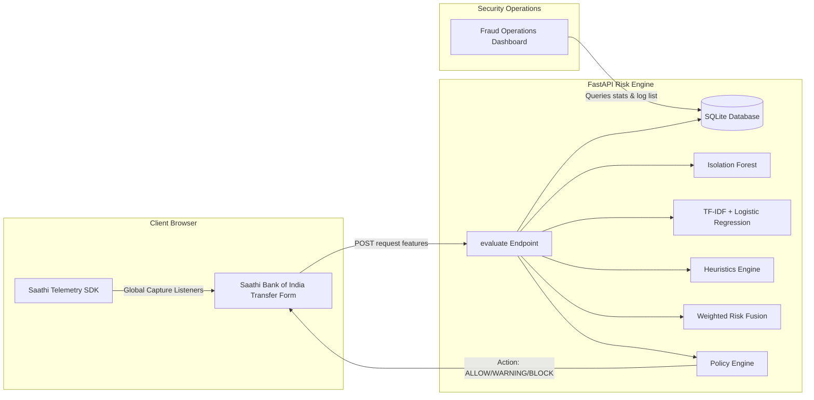

# Saathi: AI-Driven Behavioral Authentication & Coercion Defense Overlay

Saathi is an enterprise-pattern showcase demonstrating how an adaptive, privacy-preserving behavioral security layer sits beside a retail internet banking portal. It senses user interactions, detects coercion or stress (e.g., in vishing or digital arrest scams), classifies transaction intent semantics, and enforces real-time policy actions to safeguard customer funds.

---

> [!NOTE]
> **Showcase & Proof of Work Scope**: This repository is structured as a professional portfolio showcase. The retail banking portal (*Saathi Bank of India*), transaction ledger, and payment rails are **mock simulations** designed to illustrate integration touchpoints for the Saathi SDK and FastAPI Risk Engine. The behavioral biometrics tracking, database logging, machine learning pipeline, and policy fusion engines are fully functional.
> 
> 📚 **Documentation & Walkthrough**: For an in-depth guide on how Saathi AI operates, telemetry capture metrics, risk-policy fusion mechanics, and testing walk-throughs (including normal and coerced transfer scenarios), check out the [Saathi AI Testing and Understanding Guide](docs/testing-and-understanding.md).

- Mock internet banking frontend for Innovate Bank built with Next.js 14, TypeScript, Tailwind CSS, Zustand, Axios, and Recharts.
- Saathi browser SDK that captures behavioral signals locally and sends feature vectors, not raw sensitive inputs.
- FastAPI backend with layered services for anomaly detection, scam note classification, hesitation analysis, coercion detection, risk fusion, and policy decisions.
- Fraud operations dashboard with alerts, scores, explanations, and chart-based monitoring.
- JSON-backed demo alert persistence under `backend/storage/risk_alerts.json` (or database persistence when running with SQLite).
- Demo scenario endpoints for normal, suspicious, and scam-coercion payment flows.
- Sample data, scripts, Docker compose, and documentation for hackathon-style demos.

## 💻 Tech Stack & Architecture

- **Frontend Overlay**: [Next.js 14](frontend/README.md), TypeScript, Tailwind CSS, Zustand, Recharts, Axios.
- **Client Sensor**: Autonomous **Saathi Browser SDK** capturing interaction dynamics.
- **Risk Core**: [FastAPI (Python 3.11)](backend/README.md) exposing evaluated REST contracts.
- **Machine Learning**: `scikit-learn` pipeline (`IsolationForest` for behavioral anomalies, TF-IDF + `LogisticRegression` for note semantics), serialized via `joblib`.
- **Database Engine**: SQLAlchemy ORM with persistent SQLite database storage.

---

## ⚙️ Core Engineering Modules



### 1. The Saathi Browser SDK (`frontend/src/saathi-sdk`)
An autonomous, zero-dependency browser telemetry sensor that hooks globally into window inputs during the transaction lifecycle.
- **Keystroke Latency**: Measures typing rhythm speed (`avg_key_interval`) and timing consistency (`typing_variance`).
- **Correction Density**: Evaluates backspace deletes relative to total keystrokes (`backspace_rate`).
- **Interaction Swaps**: Tracks page focus changes (`focus_switch_count`) and input clipboard events (`paste_count`).
- **Cognitive Pause**: Tracks active input delays and idle durations (`hesitation_delay`, `confirmation_delay`).
- **Privacy Safeguard**: Never logs raw input values, passwords, or mouse coordinates. Extracts timing ratios locally.

### 2. Machine Learning Anomaly Core (`backend/app/ml`)
- **Behavioral Anomaly**: An `IsolationForest` model trained on synthetic typing profiles to detect erratic stress patterns characteristic of duress or vishing guidance.
- **Scam Classifier**: A `LogisticRegression` classifier parsing transfer reference notes to recognize coercion patterns (e.g., "KYC verification fee").

### 3. Persistent Database Logging
- Employs SQLAlchemy to write evaluation records to a local `saathi.db` SQLite file.
- Computes real-time aggregate statistics (active alerts count, average risk scores, critical blocks count) from database queries rather than in-memory volatile logs.

---

## 📂 Repository Directory Map

- `/frontend` - Next.js internet banking client and Saathi SDK.
  - [frontend/src/saathi-sdk](file:///c:/Users/HP/Desktop/Saathi/frontend/src/saathi-sdk) - The telemetry capture package and custom hooks.
  - [frontend/src/components/banking/TransferForm.tsx](file:///c:/Users/HP/Desktop/Saathi/frontend/src/components/banking/TransferForm.tsx) - The retail transfer interface integrated with the SDK.
- `/backend` - FastAPI application, services, and models.
  - [backend/app/database.py](file:///c:/Users/HP/Desktop/Saathi/backend/app/database.py) - SQLite connection and SQLAlchemy config.
  - [backend/app/models/database_models.py](file:///c:/Users/HP/Desktop/Saathi/backend/app/models/database_models.py) - SQLAlchemy schema for Alert items.
  - [backend/app/services](file:///c:/Users/HP/Desktop/Saathi/backend/app/services) - Anomaly, scam, hesitation, and fusion engines.
  - [backend/app/ml/training/train.py](file:///c:/Users/HP/Desktop/Saathi/backend/app/ml/training/train.py) - ML model training script.
- `/scripts` - Automation scripts for seed data, synthetic dataset generation, and training.
  - [scripts/generate_synthetic_data.py](file:///c:/Users/HP/Desktop/Saathi/scripts/generate_synthetic_data.py) - Generates 1,200+ samples of user telemetry and notes.

---

## 🚀 Getting Started

### 1. Clone & Set Up the Backend
Install dependencies, generate the synthetic dataset, train the ML models, and boot the FastAPI server:

```bash
cd backend
python -m venv .venv
source .venv/bin/activate  # On Windows: .venv\Scripts\activate
pip install -r requirements.txt

# 1. Generate the synthetic dataset (1,200+ samples)
python ../scripts/generate_synthetic_data.py

# 2. Train the ML models and dump joblib artifacts
python ../scripts/train-models.py

# 3. Launch the FastAPI Uvicorn server
uvicorn app.main:app --reload --port 8000
```

### 2. Set Up the Frontend
Install Node dependencies and boot the Next.js development server:

```bash
cd frontend
npm install
npm run dev
```
Open [http://localhost:3000](http://localhost:3000) to access the Saathi Bank of India portal.

---

## 🛡️ Demonstration Scenarios

To demonstrate the system's accuracy, test the transfer form under different simulated scenarios:

### Scenario A: Benign Transaction (Normal Behavior)
- **Amount**: ₹12,000
- **Beneficiary**: `family_savings@upi`
- **Note**: "Rent payment for June"
- **Behavior**: Regular typing speed, no backspaces, no copy-pasting, quick confirmation.
- **Expected Action**: **ALLOW** (Risk Score ~ 15-25).

### Scenario B: Coerced Transaction (Scam-Guided Behavior)
- **Amount**: ₹25,000
- **Beneficiary**: `unknown_agent_99@upi`
- **Note**: "KYC verification fee"
- **Behavior**: Copy-pasting the beneficiary ID, changing the amount multiple times, long hesitation pauses before confirmation, erratic typing rhythm.
- **Expected Action**: **BLOCK** (Risk Score > 80, showing warning detail explanation and blocking transaction completion).

---

## 📄 Licensing

- `GET /health`
- `POST /risk/evaluate`
- `POST /demo/run-scenario`
- `POST /demo/reset`
- `GET /federated/status`
- `GET /admin/overview`
- `GET /admin/models`
- `GET /dashboard/alerts`
- `GET /dashboard/stats`

Full request and response examples live in [docs/api-spec.md](docs/api-spec.md).

## Backend commands

```bash
cd backend
pip install -r requirements.txt
python -m pytest
python ../scripts/train-models.py
uvicorn app.main:app --reload --port 8000
```

## What is real vs simulated

- Risk evaluation is a working hybrid of lightweight ML artifacts, fallback heuristics, and rules.
- Saved `.joblib` artifacts are loaded when present; safe fallbacks run if artifacts are missing or unusable.
- Alerts are persisted to a local JSON file or SQLite database for demo continuity.
- Federated learning status is simulated and explicitly reports that no raw behavioral data is uploaded.
- Authentication and banking flows are demo-only mocks.

## Notes

This repository is intentionally designed as a realistic proof-of-concept for a security review or hackathon pitch. It should be integrated into an existing banking portal rather than used as a standalone retail banking application.

## 📄 Licensing

This project is licensed under the **PolyForm Noncommercial License 1.0.0**. 

The license permits free use, modification, and distribution of the software for personal study, academic research, and noncommercial purposes. Commercial exploitation, proprietary deployment, or use within for-profit corporate entities is strictly prohibited. See the [LICENSE](LICENSE) file for complete legal terms.
