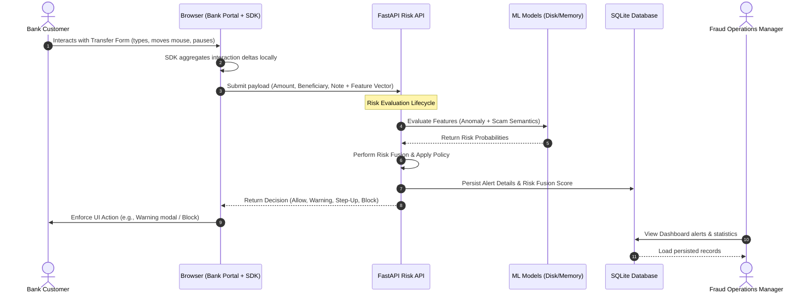

# Saathi System Architecture

Saathi is designed as an autonomous, privacy-preserving behavioral security overlay that integrates beside retail internet banking portals. It senses user interaction patterns, evaluates coercion risks, and updates fraud visibility panels dynamically.

---

## 1. High-Level Architecture

The system consists of five distinct layers:

---

## 2. Component Layers

### A. Presentation Layer (Saathi Bank of India Retail Portal)
- A simulated public sector bank portal built with **Next.js 14**, styled with **Tailwind CSS**, and using **Zustand** for state management.
- Contains the **Transfer Form** where the customer initiates transactions.
- Integrates a real-time **Telemetry Monitor** display panel on the side to visually showcase the captured features flowing out of the SDK.

### B. SDK Layer (Saathi Browser SDK)
- A self-contained TypeScript package (`saathi-sdk`) integrated into the client browser.
- **Listeners**: Attaches global listeners to the window capture phase (`keydown`, `mousemove`, `paste`, `focus`, `input`).
- **Telemetry Vector**: Accumulates and engineers metrics locally without violating user privacy:
  - **Typing Latency**: Measures intervals between key presses to compute typing rhythm averages (`avg_key_interval`) and timing consistency (`typing_variance`).
  - **Correction Density**: Tracks the backspace deletion rate relative to total keystrokes (`backspace_rate`).
  - **Mouse Jitter**: Samples mouse movements to calculate velocity averages (`mouse_speed`).
  - **Cognitive Pause**: Detects periods of inactivity between form inputs and confirmation stages (`hesitation_delay`, `confirmation_delay`).
  - **Interaction Swaps**: Tracks how often focus shifts between input boxes or window tabs (`focus_switch_count`, `paste_count`).

### C. Risk & ML Processing Layer (FastAPI Service)
- A Python 3.11 backend built on **FastAPI** exposing REST API surfaces for risk evaluation.
- Runs separate specialized micro-services:
  - **Behavioral Anomaly Service**: Employs an `IsolationForest` model trained on synthetic typing profiles to detect stress-induced cognitive anomalies.
  - **Scam Classifier**: Employs a TF-IDF vectorizer + `LogisticRegression` model trained on scam datasets to recognize scam-guided note patterns.
  - **Heuristics Engines**: Score hesitation characteristics and transaction-specific parameters (e.g. beneficiary risk for external UPI handles).

### D. Decision & Persistence Layer (SQLite + SQLAlchemy)
- **Risk Fusion Engine**: Integrates ML anomaly metrics, hesitation indexes, transaction risks, and device metadata to compute a final unified score (0 to 100).
- **Policy Engine**: Resolves the risk score into enforcement policies:
  - **ALLOW** (Risk <= 30)
  - **WARNING** (31 <= Risk <= 60)
  - **STEP_UP** (61 <= Risk <= 80)
  - **BLOCK** (Risk > 80)
- **SQLAlchemy ORM**: Connects to a persistent SQLite database (`saathi.db`) to record alert entries (`Alert` table) and compile aggregate dashboard analytics dynamically.

### E. Visibility Layer (Fraud Operations Dashboard)
- A web interface for bank security administrators.
- Queries backend endpoints (`/dashboard/alerts`, `/dashboard/stats`) to list alert items, review risk breakdowns, inspect behavioral explanations, and monitor aggregate risk averages.

---

## 3. Database Schema (`Alert` table)

The SQLite database persists transaction evaluations using the following SQLAlchemy schema definition:

| Column Name | Data Type | Key / Index | Description |
| :--- | :--- | :--- | :--- |
| `id` | `INTEGER` | Primary Key | Unique autoincrementing record identifier. |
| `customer_id` | `VARCHAR` | Indexed | Target bank customer identifier. |
| `session_id` | `VARCHAR` | Indexed | Client session token. |
| `beneficiary` | `VARCHAR` | - | Beneficiary account number or UPI handle. |
| `amount` | `FLOAT` | - | Monetary value of the transfer. |
| `risk_score` | `INTEGER` | - | Fused risk score (0 to 100). |
| `risk_level` | `VARCHAR` | - | Resolved risk label (`LOW`, `MEDIUM`, `HIGH`, `CRITICAL`). |
| `action` | `VARCHAR` | - | Resolved policy action (`ALLOW`, `WARNING`, `STEP_UP`, `BLOCK`). |
| `coercion_label` | `VARCHAR` | - | Coercion model categorization (`NORMAL`, `SUSPICIOUS`, `SCAM_GUIDED`). |
| `summary` | `VARCHAR` | - | Concise description of the evaluation outcome. |
| `explanation` | `TEXT` | - | JSON-serialized array of specific risk triggers. |
| `timestamp` | `VARCHAR` | - | ISO 8601 UTC timestamp of the evaluation. |
