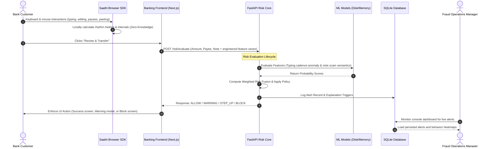

# Understanding and Testing Saathi AI: Behavioral Authentication & Coercion Defense

Saathi is an advanced, privacy-preserving behavioral security overlay designed to protect retail internet banking systems. While traditional MFA protects against credential theft, it fails against **social engineering coercion**—such as vishing (voice phishing), digital arrest threats, courier scams, or remote support impersonation—where the victim is guided by a live attacker to authorize the transfer themselves. 

Saathi acts as a silent observer, analyzing *how* the user enters information rather than *what* they enter. By correlating mouse paths, keystroke intervals, form modifications, clipboard pastes, and transaction reference semantics, Saathi identifies cognitive stress and coercion patterns to block fraudulent transfers before funds leave the bank.

---

## 1. High-Level Architecture & Data Flow

Saathi is integrated as a client-side telemetry tracker (`saathi-sdk`) that reports to a Python FastAPI Risk Engine. The engine runs parallel ML and heuristic models, resolving decisions in real-time.



---

## 2. Deep Dive: Telemetry Metrics

To preserve user privacy, the Saathi Browser SDK uses **zero-knowledge telemetry**—it does not log characters typed, exact mouse coordinates, or sensitive personal data. It logs only timing intervals, ratios, and counts:

| Telemetry Feature | Metric Code | Unit | Behavioral Context & Scam Indicators |
| :--- | :--- | :--- | :--- |
| **Average Key Interval** | `avg_key_interval` | ms | The mean time delay between keystrokes. Coerced users typing under live instructions on a call display slower typing speeds (>350ms). |
| **Typing Variance** | `typing_variance` | ms² | Keystroke timing consistency. Stressed users show highly irregular, unstable typing rhythms, resulting in high variance. |
| **Backspace Rate** | `backspace_rate` | % | Ratio of backspaces/deletes to total keystrokes. High rates (>15%) indicate hesitation, double-guessing, or updating fields under instruction. |
| **Mouse Speed** | `mouse_speed` | pixels/s | Average cursor velocity. Coerced users move cursors hesitantly or slowly, while automated bots move in perfect straight lines. |
| **Confirmation Delay** | `confirmation_delay` | seconds | Delay between the final form entry and clicking transfer. Scammers keep victims on the phone to confirm the exact moment of clicking, causing long pauses. |
| **Amount Edit Count** | `amount_edit_count` | count | Number of modifications to the transfer amount. A high count suggests uncertainty or negotiation with the attacker. |
| **Focus Switch Count** | `focus_switch_count` | count | Tabbing out of the window or toggling between fields. Users coerced to check instructions on messaging apps (e.g. WhatsApp/Telegram) switch windows frequently. |
| **Paste Event Count** | `paste_count` | count | Copied beneficiary details. Fraud victims copy account/UPI numbers sent directly by scammers instead of typing them manually. |
| **Hesitation Delay** | `hesitation_delay` | seconds | Inactivity duration inside active input fields, indicating hesitation or cognitive load. |

---

## 3. Risk Engine Lifecycle & Policy Resolvers

When `/risk/evaluate` is hit, Saathi runs four parallel evaluation modules:

1. **Behavioral Anomaly (Isolation Forest)**: An ML model trained on baseline typing speed and rhythms. Outliers (high variance, slow intervals, frequent edits) generate a high anomaly score.
2. **Scam Note Classifier (TF-IDF + Logistic Regression)**: A Natural Language Processing (NLP) model trained on text comments used in real scams. Keywords like "digital arrest," "bail," "verification fee," and "compliance" trigger high scam probabilities.
3. **Hesitation Engine (Heuristics)**: Scores delays, amount edits, and window focus switching.
4. **Transaction & Device scoring**: Computes device risk and beneficiary trust flags (e.g., checks if the UPI handle belongs to known high-risk domains).

### Weighted Risk Fusion
The scores are fused into a unified index (0 to 100). The Policy Engine maps the unified score to the following enforcement actions:

* **ALLOW (Risk <= 30)**: Transaction authorized immediately. Success screen displayed.
* **WARNING (31 <= Risk <= 60)**: Visual warning modal overlay displayed. Prompts user: *"Are you being guided on a call?"*. User can cancel or proceed.
* **STEP_UP (61 <= Risk <= 80)**: Out-of-band verification required (MFA SMS/Biometric OTP).
* **BLOCK (Risk > 80)**: Transaction blocked instantly. Explainable triggers displayed on-screen, and a record is logged in the Fraud Operations Console.

---

## 4. Automated Testing Suite (Pytest)

The Saathi backend contains automated tests verifying the FastAPI routes, ML models, and heuristic engines.

### File Structure
- `backend/app/tests/test_anomaly.py`: Evaluates the Behavioral Anomaly detector's performance on abnormal features.
- `backend/app/tests/test_api.py`: Validates FastAPI general endpoints (e.g., `/health`).
- `backend/app/tests/test_coercion.py`: Tests the integration of model scores inside the coercion decision engine.
- `backend/app/tests/test_risk.py`: Evaluates end-to-end evaluation mock payloads for BLOCK responses.

### Running Automated Tests
To execute backend tests:

1. Open a terminal and navigate to the backend directory:
   ```bash
   cd backend
   ```
2. Activate your Python virtual environment:
   ```bash
   # Windows PowerShell
   .venv\Scripts\Activate.ps1
   
   # Linux/macOS
   source .venv/bin/activate
   ```
3. Run `pytest` to execute all tests:
   ```bash
   pytest -v
   ```

---

## 5. Manual Testing Scenarios & Demonstration Scripts

To manually test the AI security overlay, run the Next.js frontend (`npm run dev` in `frontend/`) and the FastAPI backend (`uvicorn app.main:app --reload` in `backend/`) and execute the following walk-through scenarios.

### Scenario A: Benign Transaction (Normal Flow)
This scenario demonstrates how fluent, natural user actions result in an immediate transfer allowance.

1. **Log in** to NetBanking using the default user credentials.
2. Navigate to **Transfer Funds**.
3. Select a **Saved Payee** (e.g., `Priya Sharma`).
4. Enter **Amount**: `18500`.
5. Enter **Reference note**: `School fee payment`.
6. **Typing Behavior**: 
   - Type the values at a standard, steady pace.
   - Do not edit the amount.
   - Do not switch browser tabs or copy-paste fields.
7. Click **Review & Transfer**.
8. **Expected Result**: 
   - Risk Score resolves below 30.
   - Action: **ALLOW**.
   - The transaction completes successfully, presenting the success banner.

---

### Scenario B: Coerced Transaction (Scam-Guided Flow)
This scenario simulates the actions of a bank customer under duress, following live instructions on a call.

1. Navigate to **Transfer Funds**.
2. Select **Beneficiary Type**: `Pay Custom UPI / Account`.
3. In Beneficiary details, **paste** a custom UPI handle (e.g., copy and paste `agent_99@upi` using `Ctrl+V`). A `⚠️ Paste Flag` alert will trigger on the input.
4. In **Amount**: Type `25000`, then delete it and change it to `30000`, then change it again to `25000` (simulates negotiation or hesitation). The `Hesitant Edits` flag will trigger.
5. In **Reference note**: Type a known scam signature (e.g., `KYC verification fee` or `digital arrest protection fee`).
6. **Interaction Behavior**:
   - Type very slowly, with long pauses.
   - Click outside the browser tab or switch to another tab and back multiple times (focus switches).
7. Click **Review & Transfer**.
8. **Expected Result**:
   - The Telemetry HUD displays active flags (`SLOW / HESITANT`, `HIGH CORRECTIONS`, `SUSPICIOUS / MULTITASK`).
   - The Policy Engine returns a risk score > 80.
   - Action: **BLOCK**.
   - An overlay dialog interrupts: **🛡️ Transaction Blocked**.
   - Click **Go Back** or review the National Helpline (**1930**).
9. Navigate to the **Fraud Ops Dashboard** (via the sidebar "Analyst Console" or top bar link) to review the logged session detail, explanation triggers, and behavior heatmap.

---

## 6. Machine Learning Pipeline & Data Generation

If you need to re-train the ML models or update the training datasets:

1. **Generate Synthetic Data**: To generate a new dataset of 1,200+ mock transaction notes and typing telemetry vectors:
   ```bash
   python scripts/generate_synthetic_data.py
   ```
   This updates `backend/data/fraud_cases.json` and `backend/data/behavioral_profiles.json`.

2. **Train Models**: To train the Isolation Forest and Logistic Regression models and compile the binary joblib artifacts:
   ```bash
   python scripts/train-models.py
   ```
   This outputs `scam_note_model.joblib` and `behavior_anomaly_model.joblib` directly to `backend/app/ml/artifacts/`, which are hot-loaded by the FastAPI server on request.
