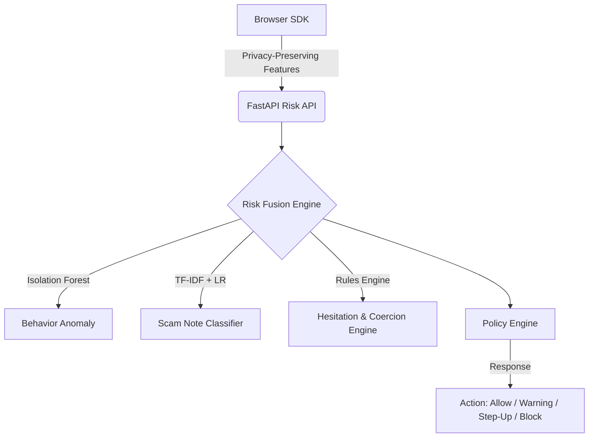

# Saathi Threat Model & Security Posture

This document outlines the security architecture, threat model, and mitigation controls of the **Saathi** behavioral security layer. It details the asset definitions, adversary capabilities, threat vectors, and engineering controls designed to mitigate social engineering and coercion in digital retail banking.

---

## 1. System Scope & Mock Context Statement
> [!IMPORTANT]
> **Mock Integration Environment**: The internet banking application (*Saathi Bank of India*) and the ledger/payment rails included in this repository are **simulated stubs** designed to demonstrate how Saathi integrates as an overlay. Saathi is designed to sit alongside production Core Banking Systems (CBS) and Transaction Risk Management (TRM) portals, acting as a behavioral biometrics sensor.

---

## 2. Protected Assets

- **Customer Funds**: The financial balance of the customer, protected from fraudulent exfiltration.
- **Session Integrity**: The authorization state of the user's active session, shielding it from hijackers or unauthorized overlays.
- **Privacy-Preserving Telemetry**: Behavioral indicators (keystroke timings, mouse coordinates) that must be collected and transmitted securely without logging sensitive inputs (such as passwords, credit card numbers, or personally identifiable information).
- **Decision Integrity**: The risk evaluation outputs, which must be protected against tampering to ensure policy enforcement (e.g., blocking or stepping up critical threats).

---

## 3. Threat Landscape & Adversary Profiles

### A. Adversary Profiles
1. **Remote Social Engineer (Vishing Caller)**: Operates by calling the customer, pretending to be a bank official, telecom operator, or law enforcement agent. They direct the user to transfer funds to a "safe account" (digital arrest or KYC verification scams).
2. **Coercive Actor (Physical/Mental Threat)**: Exerts direct pressure on the user to make a payment. The user acts under duress, exhibiting irregular hesitation, high confirm delays, and typing stress.
3. **Session Hijacker (Remote Access Trojan - RAT)**: Uses remote control software (e.g., AnyDesk, TeamViewer) to execute transfers on behalf of the victim. They exhibit machine-like patterns or abnormal mouse movement coordinates originating from standard input emulation.

### B. Principal Threat Scenarios

| Threat ID | Threat Scenario | Attack Vector | Security Impact |
| :--- | :--- | :--- | :--- |
| **T-01** | **Scam-Guided Payment** | Scammer instructs user to write notes like "KYC Verification Fee" and transfer to a specific UPI. | Financial loss to customer; bank reputational damage. |
| **T-02** | **Coerced Transfer under Duress** | Victim enters transfer details under physical or digital coercion (e.g., digital arrest threats). | Financial loss; physical/psychological safety issues. |
| **T-03** | **Remote Access Takeover** | Attacker uses a RAT to control the banking screen and execute transactions. | Complete account compromise; unauthorized exfiltration. |
| **T-04** | **Telemetry Evasion** | Attacker attempts to bypass SDK capture by disabling scripts or spoofing browser variables. | Bypassing anomaly detection layers, leading to false negatives. |

---

## 4. Security Controls & Mitigations

### 1. Privacy-Preserving Telemetry (Mitigates Keystroke Logging Risks)
- **Control**: The Saathi Browser SDK does not log raw keystroke values, password fields, or exact mouse coordinates. Instead, it measures interval differences (e.g., key down-to-key down delta) and velocity averages locally.
- **Impact**: Zero risk of capturing sensitive user credentials or personal messages.

### 2. Machine Learning Anomaly Detection (Mitigates T-02 & T-03)
- **Control**: An `IsolationForest` model trained on normal user interaction profiles detects sudden shifts in typing rhythm, high backspace usage (stress indicators), and irregular mouse movements (such as machine-emulated movements or vishing-guided hesitation).
- **Impact**: Flags sessions showing signs of high stress, user distraction, or remote control.

### 3. Scam Note Classifier (Mitigates T-01)
- **Control**: A `LogisticRegression` classifier with `TfidfVectorizer` parses reference notes, scanning for semantic patterns characteristic of vishing scams (e.g., "verification deposit", "compliance payment", "unlock fee").
- **Impact**: Provides high-accuracy scam detection that bypasses basic keyword-hashing bypass attempts.

### 4. Coercion & Hesitation Engine (Mitigates T-01 & T-02)
- **Control**: Heuristic engines track active input pauses, confirmation delays, target field focus switches, and copy-paste events (often indicating copying accounts from a WhatsApp scam chat).
- **Impact**: Fuses physical and cognitive indicators of user hesitation.

### 5. Policy Engine & Escalation Paths (Mitigates T-01, T-02, T-03)
- **Control**: Policy decisions range from silent allowance to security warnings, multi-factor step-ups (out-of-band verification), or immediate transaction blocks.
- **Impact**: Blocks high-risk activities instantly while providing explanations to help fraud operations managers understand the decision context.

---

## 5. Evasion Resilience & Non-Goals

### Evasion Resilience
- **Window Capture Listeners**: The SDK hooks into the global event capture phase rather than bubbled event handlers, preventing web forms from intercepting or suppressing telemetry events.
- **Risk Fusion Fallbacks**: If ML models are unavailable or if artifact loading fails, the backend automatically fails-safe by falling back on heuristic estimators to compute behavioral risk.

### Non-Goals
- **Replacing Transaction Limits**: Saathi is not designed to replace standard transaction limits, transaction monitoring, or identity verification layers. It is an adaptive addition to existing controls.
- **Universal Fraud Prevention**: Saathi specifically targets **coerced, scam-guided, and remote access transfers**. It does not monitor credential harvesting or malware injections outside the active banking tab.
